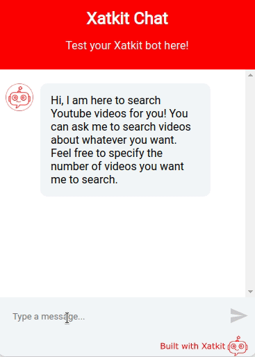
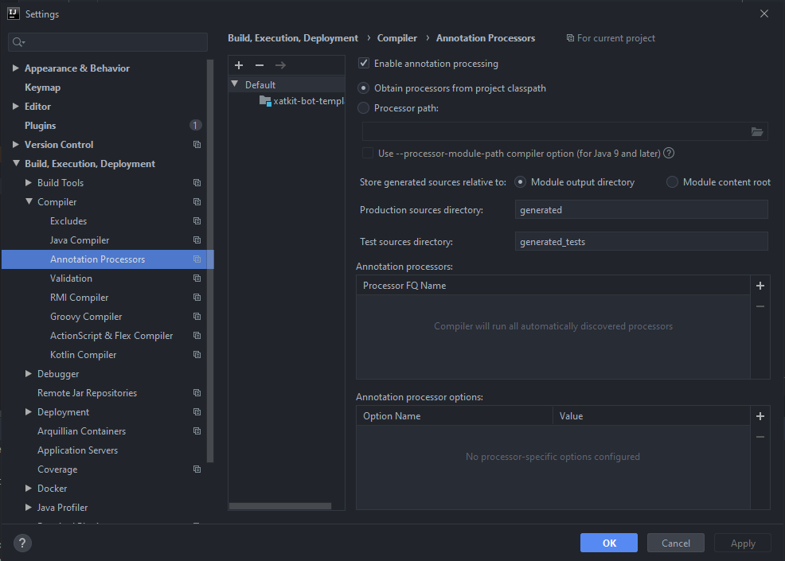

# Xatkit Bot Youtube
This repository contains a xatkit bot built on [xatkit-bot-template](https://github.com/xatkit-bot-platform/xatkit-bot-template/)

This bot can search Youtube videos for you. You only need to ask him to search videos about whatever you want.

It uses [Dialogflow](https://dialogflow.cloud.google.com) as NLP engine and [Youtube Data API v3](https://developers.google.com/youtube/v3) to request Youtube contents.

Visit the [xatkit wiki](https://github.com/xatkit-bot-platform/xatkit/wiki) for more info about Xatkit!



## Build the bot
1- [Build the latest version of Xatkit](https://github.com/xatkit-bot-platform/xatkit/wiki/Build-Xatkit)

2- Navigate to `xatkit-examples/` and clone this repository

3- [Create a Dialogflow agent](https://github.com/xatkit-bot-platform/xatkit/wiki/Integrating-DialogFlow) to use it with the bot.

When you configure Xatkit, make sure you edit these lines on [YoutubeBot.java](/src/main/java/com/xatkit/example/YoutubeBot.java)
```java
botConfiguration.setProperty("xatkit.dialogflow.projectId", "YOUR PROJECT ID");
botConfiguration.setProperty("xatkit.dialogflow.credentials.path", "PATH TO YOUR DIALOGFLOW CREDENTIALS");
```

4- [Get authorization credentials for the Youtube Data API v3](https://developers.google.com/youtube/registering_an_application). For this application it is not needed to obtain OAuth 2.0 credentials since the app does not have access to your Youtube information (it does not modify your account content). Make sure you obtain an API key.

5- Once you have your API key, edit these code lines in [YoutubeAPI.java](/src/main/java/com/xatkit/example/YoutubeAPI.java)
```java
private static final String DEVELOPER_KEY = "YOUR API KEY";
private static final String APPLICATION_NAME = "YOUR APP NAME";
```
:warning: **API keys are private and you must not publish them in a public repository!**

## Start the bot

Navigate to `xatkit-examples/xatkit-youtube-bot` and start the digital assistant (a web-based bot)

```bash
mvn clean compile
mvn exec:java -Dexec.mainClass="com.xatkit.example.YoutubeBot"
```

The console will log some initialization information, and after a few seconds you should see the following message:

```bash
INFO   - Xatkit bot started
```

Open your browser and navigate to http://localhost:5000/admin and start chatting with your bot!

## Editing the bot (optional)

Feel free to modify the bot however you want him to act. For instance, you can modify the training sentences of the "search" intent of the bot

```java
val search = intent("Search")
    .trainingSentence("Search KEYWORD")
    .trainingSentence("Search NUM videos of KEYWORD")
    .trainingSentence("Search NUM videos about KEYWORD")
    .trainingSentence("Give me KEYWORD")
    .trainingSentence("Give me NUM videos of KEYWORD")
    .trainingSentence("Give me NUM videos about KEYWORD")
    .trainingSentence("Search KEYWORD and give me NUM videos")
    .parameter("keyword").fromFragment("KEYWORD").entity(any())
    .parameter("num").fromFragment("NUM").entity(integer());
```
Remember that you don't need to use these explicit sentences when talking to the bot. Dialogflow uses Machine Learning to infer the training sentence you are referring to!

## Troubleshooting

- IntelliJ error: `java: incompatible types: com.xatkit.dsl.intent.IntentOptionalTrainingSentenceStep cannot be converted to lombok.val` ➡ You need to enable annotation processing in your project (see image below).



# Website

[xatkit.com](https://xatkit.com/)
